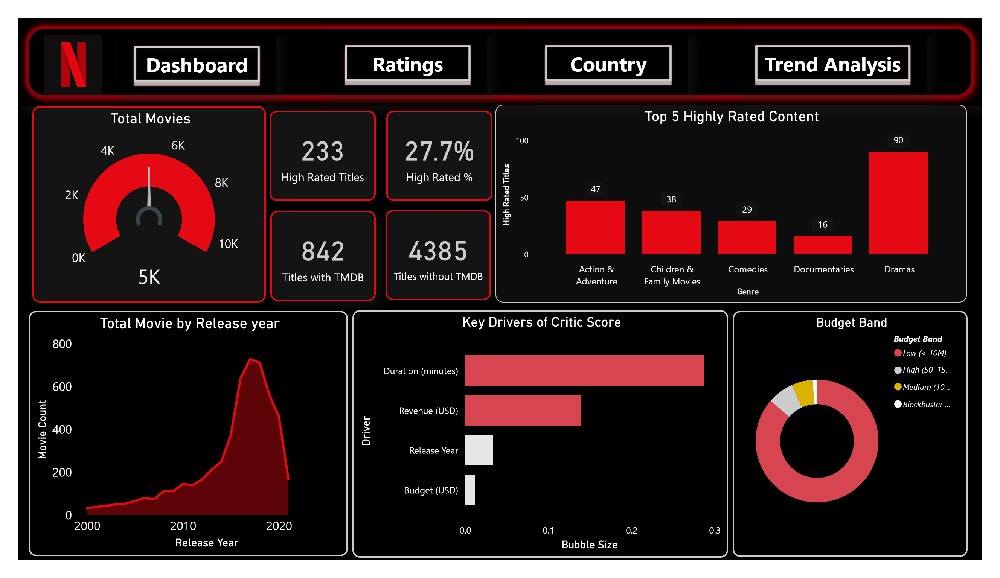
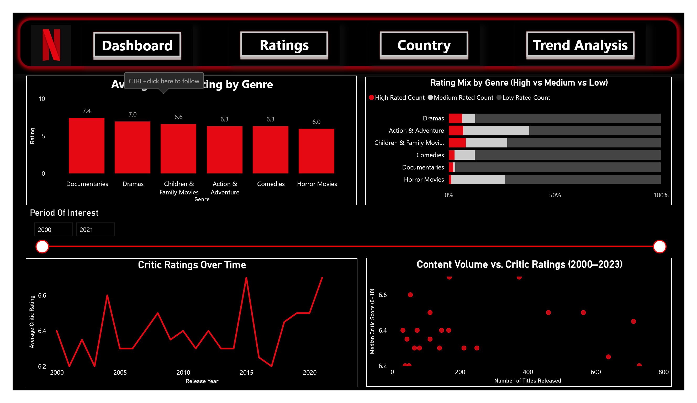
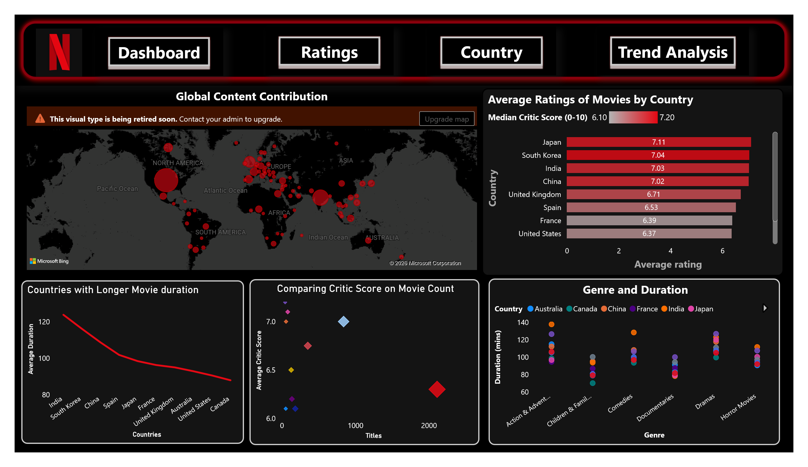
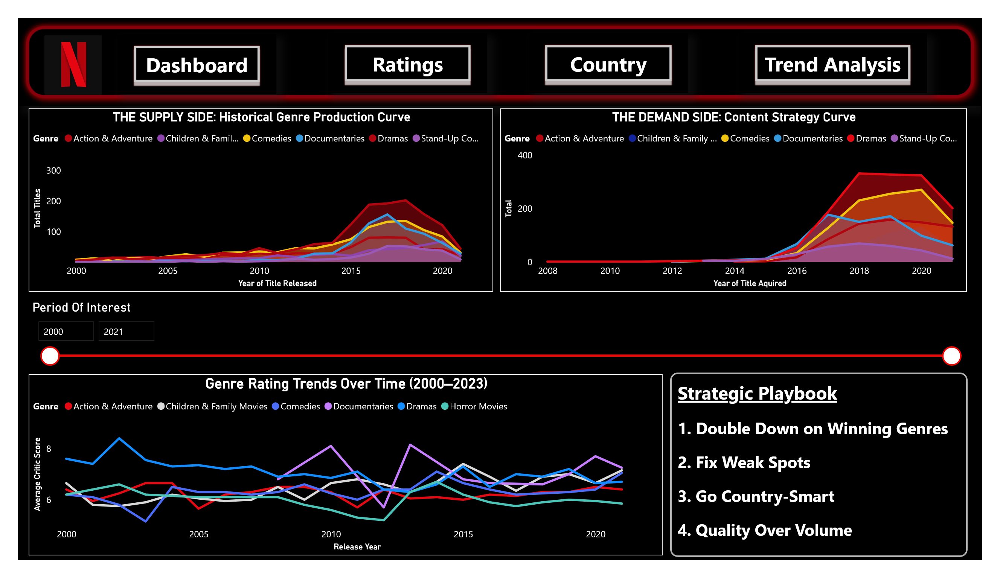

# Netflix Content Clustering and Power BI Dashboard

This project combines Netflix catalogue data with movie rating attributes to analyse content performance, genre patterns, country trends, and content clusters.

## Business Problem

Streaming platforms need to understand which content categories perform well, how ratings vary across genres and countries, and where catalogue strategy can be improved. This project uses clustering and dashboard reporting to support content strategy decisions.

## What This Project Demonstrates

- Data preparation and integration of Netflix and movie-rating datasets
- Feature engineering for genre, duration, country, and critic-score analysis
- K-means clustering using encoded categorical variables and scaled numeric features
- Cluster selection using Elbow and Silhouette methods
- PCA visualisation and cluster profiling
- Power BI dashboarding for content trends, ratings, country analysis, and strategic insights

## Tools Used

- R
- tidyverse
- caret
- cluster
- ggplot2
- Power BI

## Repository Structure

```text
.
├── data/
│   ├── merged_netflix_imdb_dataset.csv
│   └── netflix_clustering_data.csv
├── powerbi/
│   └── netflix_content_dashboard.pbix
├── reports/
│   ├── powerbi_dashboard_page_1.png
│   ├── powerbi_dashboard_page_2.png
│   ├── powerbi_dashboard_page_3.png
│   └── powerbi_dashboard_page_4.png
├── src/
│   └── netflix_clustering_analysis.R
└── README.md
```

## Dashboard Pages

The Power BI dashboard is included as a `.pbix` file. GitHub may not preview `.pbix` files directly, so dashboard pages are embedded below as images.

### Overview



### Ratings



### Country Analysis



### Trend Analysis


